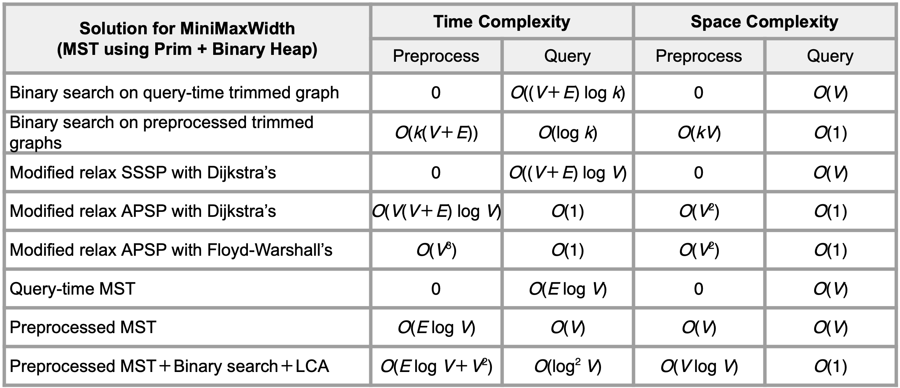

    github.com/tangboxuan
<table>
<tr><th><h3>Time Complexity</h3></th><th><h3>Searching</h3></th></tr>
<tr>
<td>
  
logn=log(n^2) < n^1/2 < n < nlogn=logn! < n^2 < 2^n < 2^2n  

|Recurrence           |Runtime|
|:---:|:---:|
|T(n) = S(0,n-1)T(i) = 2T(n-1)|2^n|
|T(n) = 2T(n/2) + O(n)|nlogn|
|T(n) = T(n/2) + O(n)|n|
|T(n) = 2T(n/2) + O(1)|n|
|T(n) = S(0,sqrt(n))T(i) + sqrt(n)|n|
|T(n) = 2T(n/4) + O(1)|sqrt(n)
|T(n) = T(n/2) + O(1)|logn|
</td>
<td>

|Search|Runtime|
|:---:|:---:|
|Linear|n|
|Binary|logn|Must be sorted|
|Quickselect|n|Find k largest
|||
|Knuth Shuffle|n|for (1,n-1): swap(i,rand(0,i))
|Merkel Tree|logn|Search for differences|

Knuth Shuffle:  
for (1,n-1): swap(i,rand(0,i))
</td>
</tr>
</table>

## Sorting

|Algorithm|Best|Average|Worst|Stable|Space|Remarks|
|:---:|:---:|:---:|:---:|:---:|:---:|:---:|
|Bubble|n|n^2|n^2|Yes|1|**Largest k items are in final k positions**|
|Selection|n^2|n^2|n^2|No|1|**Smallest k items are in smallest k positions**|
|Insertion|n|n^2|n^2|Yes|1|**First k items are sorted**|
|Merge|nlogn|nlogn|nlogn|Yes|n|**Groups of 2^x are sorted**|
|Quick|nlogk|Median/ Random/ Check nlogk|Specific nk|No|logn|**Array is partitioned around pivot** T(n) = pT(n/p) + O(nlogp) = nlogn Duplicate: n^2 if no 3-way partition|
|Heap|nlogn|nlogn|nlogn|No|1|Build Heap: n, Get Sort: nlogn|
|Reversal||n(logn)^2||||Quicksort with Mergesort around pivot

## Data Trees

|Structure|Operation|Remark|
|:---:|:---:|:---:|
|Binary Search|h|Full Tree: n = 2^(h+1) - 1 **Delete** if x has 2 child: replace x with successor(x) **Successor** right.min() or recurse to (left of parent or root)
|Scapegoat|logn|Rebuild subtree rooted at scapegoat when triggered|
|AVL|logn|h < 1.44logn or n > 2^(h/1.44) v.left Left Heavy or Balanced: right(v) v.left Right Heavy: left(v.left), right(v) **Insert** 2 x R **Delete** 2logn x R
|Trie|L|More space due to more overhead|
|(a,b)|logn|**Split** for insert, **Merge+Share** for delete
|kd|h|Alternate splitting horizontally and vertically
|Heap|logn|1. Heap Ordering: Pr(parent) >= Pr(child) 2. Complete Binary Tree **Delete** Swap(last), Bubble Down Array: Left(x)=2x+1, Right(x)=2x+2|
|Leftist Heap|logn|max rightRank = logn, max height = n **Merge** (logn) merge smaller root with right child of other swap if left>right, update rightRank **Insert** merge with single vertex, swap <= 1 **GetMax** remove root, merge child **Delete** update rightRank (stop if left child), swap <= 1|

|Augmented Structure|Remark|
|:---:|:---|
|Dynamic Order Statistic|Stores weight of subtree. During functions, rank = left.weight + 1 **Select** left.weight < rank: left.select(k). Else: right.select(k-rank) **Rank** recurse to root, if node is right child: rank += parent.left.weight + 1
|Interval Tree|Sort by left endpoint. Stores max endpoint in node's subtree **Search** (logn) If x > max or left is null, search(right). Else: search(left) **All Overlap** (klogn) search node, add to list, delete node, repeat until null|
|Orthogonal Range Search|Store all points as leaves of a BST. Internal nodes stores max of left. **Range Query** (k+logn) find split node. do left & right traversals.  **2D Range Query** (k+(logn)^2) for node in x-tree, build y-tree using nodes in subtree. **Build2D** T(nlogn) S(nlogn)|

## Hashing 
Must redefine **hashCode** _default returns address_ and **equals** _for **get** to work_  
|Hash Table|Insert|Search|Space|Remarks|
|:---:|:---:|:---:|:---:|:---:|
|Linked List|h+1 = 1|h+n/m = 1|m+n|Simple Uniform Hashing Assumption: Equally mapped to every bucket Worst case for search = n|
|Linked List w/ Resize|amor(1)|exp(1)|m+n|Ideal: n==m -> Double Table . n<m/4 -> Half Table Increment O(n^2) . Double O(n) . Square O(n^2)|
|Open Addressing|h + 1/(1-a), |where a = n/m a<  1|n|Uniform Hashing Assumption: Equally mapped to every permutation Linear Probing - Clusters Double Hashing - h(k,i) = f(k) + ig(k) mod _m_, (m,g(k)) -> n^2 permutations !UHA **Delete** sets node to tombstone value for **search**|
|Fingerprint Bloom|k|k||False positive. No false negative. **Delete**(Counter/Tombstone) -> False negative _Let p = P(False positive)_ FHT: p = 1-e^(-n/m) . n/m <= ln(1/1-p) BT: p = (1-e^(-kn/m)^k) . opt(k) = (m*ln2)/n|

## Graphs & Trees
Adjacency List O(V+E) Adjacency Matrix O(V^2) Edge List O(E)
|SSSP|Runtime|Remarks|
|:---:|:---:|:---:|
|Bellman-Ford|VE|No negative cycles|
|Dijkstra|ElogV(AVL) E+VlogV(Fibo Heap)|No negative edge Vx(insert+deleteMin) + Ex(decreseKey)|
|Toposort Relax|V+E E|No directed cycles (Directed Acyclic Graph) Post-order DFS or Kahn's(get nodes w/o in-edges)|
|BFS|V+E(Queue)|Same Weight|
|DFS|V+E(Stack)|No cycle (Tree)|
||||
|LCA|(logV)^2|Store depth and skip pointers to ancestors 2^n up Binary search isAncestor(_getAncestor(u,hops)_,v)|
|MED|nm|Toposort + Relax|

<table>
<tr>
<td>

|MST|Runtime|Idea|
|:---:|:---:|:---:|
|Prim's|Dijkstra's E(known)|Add min edge on cut|
|Kruskal's|ElogV aE(known)|Add min edge not in same tree Sort + ExUF = ElogE + Ea(n)|
|Boruvska's|ElogV|Every step: Add min edge for every node Search min out-edge = V+E using B/DFS Update component ID = V|

</td>
<td>

MST Property
1.Max edge in **cycles** NOT in MST
2.Min edge in **cut** IS in MST  

Steiner Tree (<2xOPT)  
1.Run APSP & build new graph
2.Run MST and remove duplicate edges  

Rooted Directed Graph:  
Add min incoming edge O(E)  

Faster MST (EloglogV):  
1.loglogV Boruvska's
2.Prim's using Fibo Heap
</td>
</tr>
</table>

<table>
<tr>
<td>

|Union-Find|Find|Union|
|:---:|:---:|:---:|
|Quick Find|1|n|
|Quick Union|n|n|

</td>
<td>

|Union-Find|Find|Union|
|:---:|:---:|:---:|
|Weighted Union|logn|logn|
|Weighted Union + Path Compression|a(m,n)|a(m,n)|

</td>
</tr>
</table>

## Dynamic Programming

|DP|Runtime|Subproblem|
|:---:|:---:|:---:|
|LIS|n^2|**S[i]** = max(**S[j]**)+1 for all j>1 and S[j]>S[i]. Base: S[n]=0|
|Prize|kE|**P[v,k]** = max(**P[w,k-1]**)+W(w,v) for all w points to v. Base: P[v,0]=0|
|Vertex Cover|V|**S[v,0]** = sum **S[w,1]** and **S[v,1]** = 1 + sum min(**S[w,0]**, **S[w,1]**) for all w neighbour of v. Base: S[leaf,0]=0 S[leaf,1]=1|
|Road Trip|nL^2|**Cost[n,f]** = min(**Cost[n+1,f-d+i]**+c*i), start n with f fuel, d<=f<=L|
|APSP|V^3|S[v,w,n] = min(**S[v,w,n-1]**, **S[v,n,n-1]**+**S[n,w,n-1]**) Base: S[v,w,0]=W(v,w) P[v,w,n] = P[v,w,n-1] OR P[v,n,n-1] AND P[n,w,n-1]|

<table><tr><td>

|APSP|Runtime|Method|
|:---:|:---:|:---:|
|Sparse +ve|(V^2)logV|Dijkstra's|
|Unweighted|VE|BFS|
|All|V^3|Floyd-Warshall|

</td><td>

</td></tr></table>